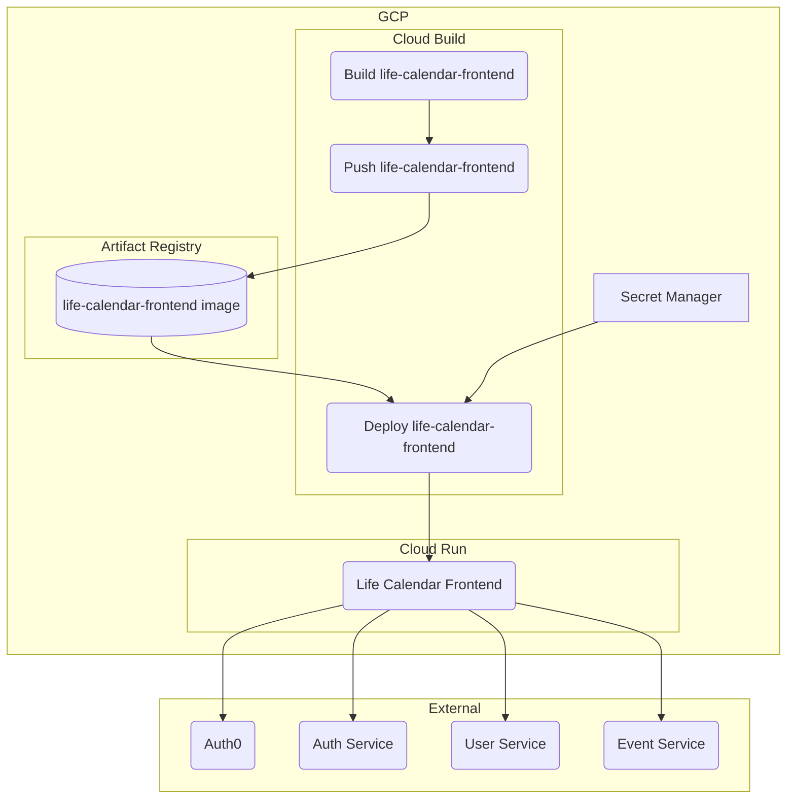

# Life Calendar Frontend

[life-calendar.qkitzero.xyz](https://life-calendar.qkitzero.xyz)

```mermaid
flowchart TD
    subgraph gcp[GCP]
        secret_manager[Secret Manager]

        subgraph cloud_build[Cloud Build]
            build_life_calendar_frontend(Build life-calendar-frontend)
            push_life_calendar_frontend(Push life-calendar-frontend)
            deploy_life_calendar_frontend(Deploy life-calendar-frontend)
        end

        subgraph artifact_registry[Artifact Registry]
            life_calendar_frontend_image[(life-calendar-frontend image)]
        end

        subgraph cloud_run[Cloud Run]
            life_calendar_frontend(Life Calendar Frontend)
        end
    end

    subgraph external[External]
        auth0(Auth0)
        auth_service(Auth Service)
        user_service(User Service)
        event_service(Event Service)
    end

    build_life_calendar_frontend --> push_life_calendar_frontend --> life_calendar_frontend_image

    life_calendar_frontend_image --> deploy_life_calendar_frontend --> life_calendar_frontend

    secret_manager --> deploy_life_calendar_frontend

    life_calendar_frontend --> auth0
    life_calendar_frontend --> auth_service
    life_calendar_frontend --> user_service
    life_calendar_frontend --> event_service
```
